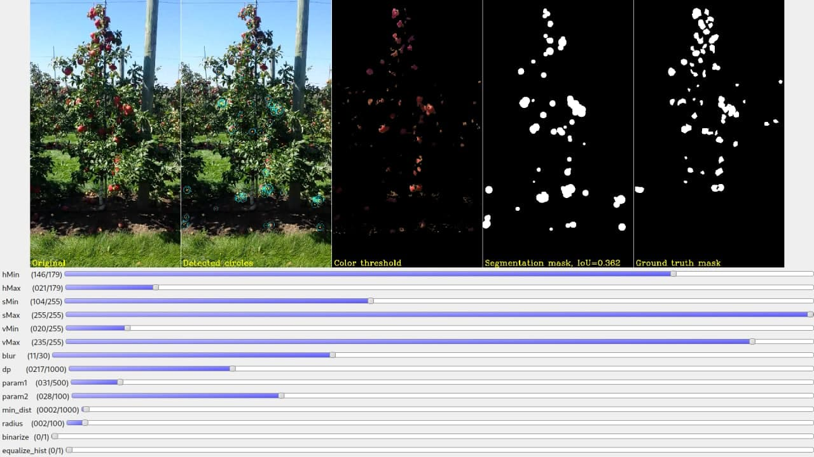

# Computer vision pipeline for on-tree fruit segmentation 

## Dataset: 
 - Benchmark Dataset for Apple Detection and Segmentation
 - Github: https://github.com/nicolaihaeni/MinneApple 
 - Paper: https://arxiv.org/abs/1909.06441 

## Image examples:

	

## CV class segmentation pipeline: 
 - Reduce noise (blur)
 - Convert image to HSV color space
 - Threshold colors (Hue) to filter only fruits ( e.g. “red-ish” )
 - Run Circle Hough Transform to detect circles ( apples are presumably “round-ish” )
 - Produce final segmentation mask and calculate IoU metric using the ground truth segmentation mask ( all individual instance masks are merged into one class “apple” )
 - Calculate mean IoU of the dataset
 - Perform automated parameters tuning to maximize mean IoU of the dataset (Optuna library)

 ## The code:
 - **apple_dataset.py** - class to load the dataset
 - **final.py** - pipeline functions
 - **train.py** - training/evaluation
 - **tune.py** - parameters optimization
 - **hough_circles_trackbar.py** - visualization tool to play with the parameters and see intermediate pipeline results
 - to run the code first download **detection.tar.gz** from https://conservancy.umn.edu/handle/11299/206575, extract the contents and check the dataset path in **apple_dataset.py**

 ## Results:
  
  - Mean IoU ~0.27 on a subset containing red apples
  - Fails on green apples
  - Baseline [provided](https://github.com/nicolaihaeni/MinneApple) by the dataset authors: 
    - IoU = 0.410
    - U-Net ( with ResNet50 backbone )
  - Ground truth segmentation masks do not contain fallen apples

  
 
